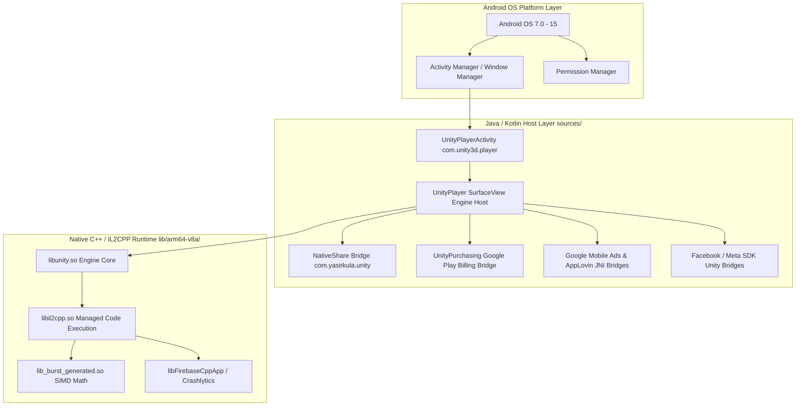
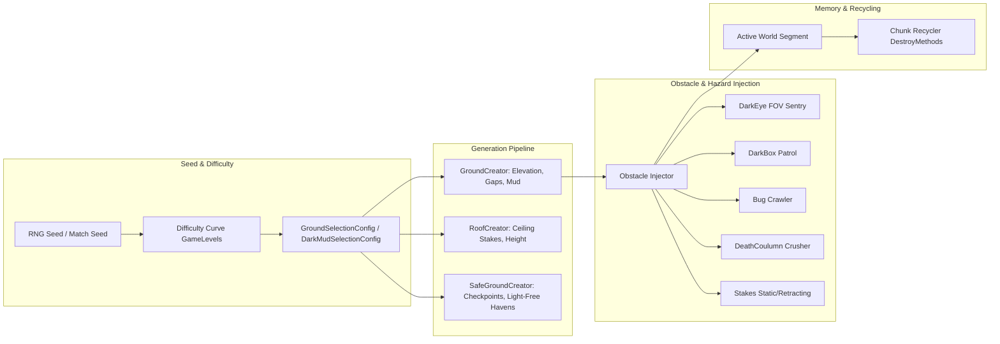
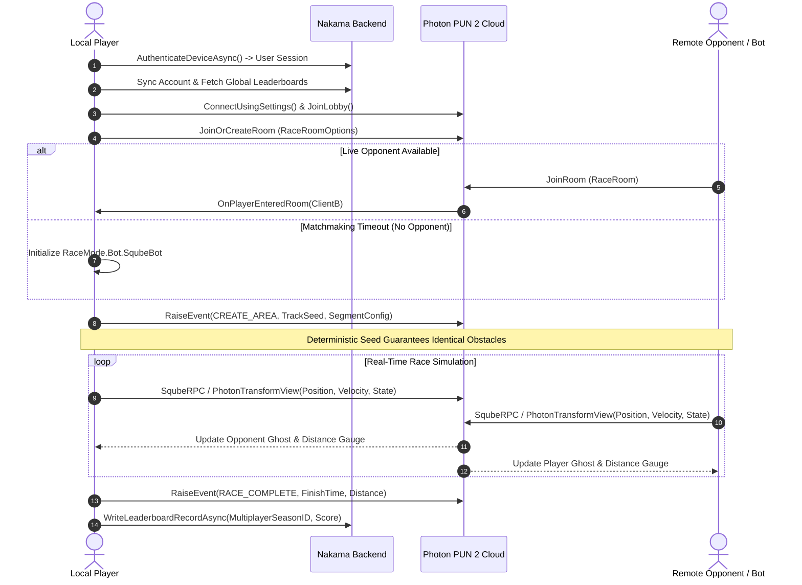
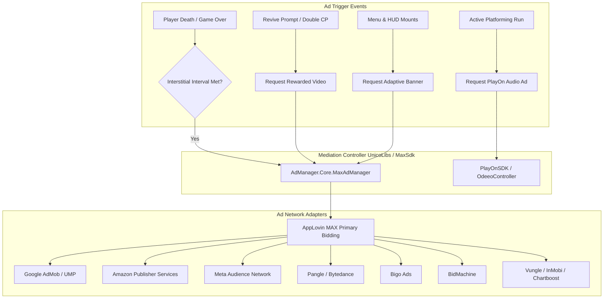

# Comprehensive Application Architecture Report: Sqube Darkness

**Package Name:** `com.RHPOSITIVE.squbedarkness`  
**Application Title:** Sqube Darkness  
**Version:** 5.0.1 (Build Code: `78`)  
**Target Platform:** Android (Min SDK: 24 / Android 7.0; Target SDK: 35 / Android 15)  
**Source Inputs Analyzed:** Extracted `sources/` (decompiled Java/Kotlin), `resources/` (assets, manifests, resources), and native ELF binaries (`lib/arm64-v8a/`)  
**Analysis Type:** Clean-Room Architectural Reverse Engineering & Reimplementation Specification  

---

## 1. Executive Summary & Technology Stack Matrix

**Sqube Darkness** is a 2D stealth platformer, endless runner, and real-time multiplayer racing game designed with high-contrast geometric silhouettes, dynamic light/shadow evasion mechanics, procedural track construction, and an enterprise-grade live-ops and ad-mediation backend.

### Technology Stack & Component Breakdown

| Layer | Technology / Framework | Specific Artifacts & Libraries | Role in Architecture |
| :--- | :--- | :--- | :--- |
| **Game Engine** | **Unity Engine 6** (`6000.0.56f1`) | `libunity.so` (22 MB), `libil2cpp.so` (69.7 MB), `data.unity3d` | High-performance C# runtime compiled Ahead-Of-Time (AOT) to native ARM64 assembly via IL2CPP. |
| **Rendering Pipeline** | **Universal Render Pipeline (URP 2D)** | 2D Light Mesh Renderer, Sprite Shadow Casters, Shader Graph | High-performance 2D dynamic lighting, real-time shadow casting, and custom atmospheric post-processing. |
| **Math Acceleration** | **Unity Burst Compiler & DOTS** | `lib_burst_generated.so` (300 KB), `Unity.Mathematics.dll`, `Unity.Collections.dll` | SIMD-optimized vector math, procedural raycast batching, and polygon triangulation for FOV vision meshes. |
| **Android Host Runtime** | **Java / Kotlin Android Layer** | `sources/com/unity3d/player/*`, `sources/androidx/*` | Android lifecycle management, surface view hosting, permission requests, and window insets handling. |
| **Native Java Bridges** | **JNI Plugin Bridges** | `com.yasirkula.unity.NativeShare`, `com.unity.purchasing.common.UnityPurchasing`, `com.google.unity.ads.*` | Java-to-C# JNI bridge wrappers for OS sharing, Google Play Billing, and native ad views. |
| **UI & Typography** | **TextMeshPro + Unity UI + DOTween** | `Unity.TextMeshPro.dll`, `UnityEngine.UI.dll`, `DOTween.dll` | Resolution-independent Signed Distance Field (SDF) typography, responsive anchoring, and tween animation sequencing. |
| **Realtime Networking** | **Photon PUN 2 & Photon Realtime** | `PhotonUnityNetworking.dll`, `PhotonRealtime.dll`, `PhotonChat.dll` | Low-latency room matchmaking, deterministic procedural seed sync, RPC dispatch, and position interpolation. |
| **Backend & Identity** | **Heroic Labs Nakama** | `Nakama.dll`, `NakamaRuntime.dll`, `websocket-sharp.dll` | Device authentication, player profiles, cloud storage persistence, and global/seasonal leaderboards. |
| **Data Persistence** | **Encrypted JSON/Binary Save System** + `SafeTypes` | `RHP.Save.Core`, `SafeInt`, `SafeFloat`, `SafeDouble`, `SafeLong` | Anti-cheat memory obfuscation with XOR masking and AES/device-bound file encryption. |
| **Telemetry & Crash Reporting**| **Firebase SDK (C++ & C#)** + **Adjust** | `libFirebaseCpp*.so`, `libcrashlytics*.so`, `AdjustSdk.Scripts.dll` | Remote configuration parameters, crash symbolication, event analytics, and acquisition attribution. |
| **Ad Mediation Suite** | **AppLovin MAX + AdMob + APS** | `MaxSdk.Scripts.dll`, `GoogleMobileAds.dll`, `Amazon.Scripts.dll`, `AudienceNetwork.dll` | Multi-network hybrid waterfall & real-time bidding mediation across 10+ ad networks. |
| **Audio Advertisements** | **PlayOn SDK (Odeeo)** | `PlayOnSDK.dll`, `assets/ad-viewer/*` | Non-intrusive in-game background audio ad playback. |
| **In-App Purchasing** | **Unity IAP + Gley EasyIAP** | `UnityEngine.Purchasing.dll`, `GooglePlayTangle.cs`, `Gley.EasyIAP` | Google Play Billing v7/v8 integration with local receipt validation and product catalog management. |
| **Localization & Shaping** | **RHP.TMPLocalization** + **ArabicFixer** | `RHP.TMPLocalization.*`, `res/values-*` (80+ locales) | Multi-language localization with custom RTL Arabic glyph joining and diacritics shaping. |

---

## 2. Android Host Architecture & Decompiled Java/Kotlin Analysis

Inspection of the decompiled `sources/` and `resources/com.RHPOSITIVE.squbedarkness.apk/AndroidManifest.xml` reveals a multi-layered host platform architecture:



### 2.1 Android Manifest & Component Declarations
- **Main Launcher Activity**:
  - `com.unity3d.player.UnityPlayerActivity`  
    - `android:screenOrientation="sensorLandscape"`
    - `android:configChanges="density|fontScale|keyboard|keyboardHidden|layoutDirection|locale|mcc|mnc|navigation|orientation|screenLayout|screenSize|smallestScreenSize|touchscreen|uiMode"`
    - `android:hardwareAccelerated="true"`
    - `android:exported="true"` with `android.intent.action.MAIN` and `android.intent.category.LAUNCHER`.
- **System Permissions**:
  - **Networking & Connectivity**: `android.permission.INTERNET`, `android.permission.ACCESS_NETWORK_STATE`, `android.permission.ACCESS_WIFI_STATE`.
  - **Monetization & Attribution**: `com.android.vending.BILLING`, `com.google.android.gms.permission.AD_ID`, `android.permission.ACCESS_ADSERVICES_AD_ID`, `android.permission.ACCESS_ADSERVICES_ATTRIBUTION`, `android.permission.ACCESS_ADSERVICES_TOPICS`, `com.google.android.finsky.permission.BIND_GET_INSTALL_REFERRER_SERVICE`, `com.applovin.array.apphub.permission.BIND_APPHUB_SERVICE`.
  - **Hardware & UX**: `android.permission.VIBRATE`, `android.permission.WAKE_LOCK`, `android.permission.FOREGROUND_SERVICE`.
  - **Custom Security Permission**: `com.RHPOSITIVE.squbedarkness.DYNAMIC_RECEIVER_NOT_EXPORTED_PERMISSION` (Protects internal broadcast receivers against cross-app intent injection on Android 14+).
- **Content Providers & Initialization Pipeline**:
  - `androidx.startup.InitializationProvider`: Initializes AndroidX libraries on cold boot.
  - `com.applovin.sdk.AppLovinInitProvider`: Zero-code initialization of AppLovin MAX SDK.
  - `com.facebook.internal.FacebookInitProvider`: Initializes Meta Audience Network.
  - `io.bidmachine.BidMachineInitProvider`: Prepares BidMachine ad exchange.
  - `com.RHPOSITIVE.squbedarkness.BigoAdsProvider`: Initializes Bigo Ads SDK.

### 2.2 Native Java Bridges & Interop
- **Native Social Sharing (`com.yasirkula.unity.NativeShare`)**:
  - `NativeShare.java`, `NativeShareFragment.java`, `NativeShareCustomShareDialogActivity.java`, `NativeShareBroadcastReceiver.java`.
  - Provides seamless Android `Intent.ACTION_SEND` and `ACTION_SEND_MULTIPLE` integration for high-score screenshots and invite links with targeted MIME types.
- **In-App Purchasing Bridge (`com.unity.purchasing.common.UnityPurchasing`)**:
  - Java-side bridge managing Google Play Billing Client sessions, product querying, purchase token delivery, and acknowledge callbacks.
- **Advertising JNI Wrappers (`com.google.unity.ads.*`)**:
  - `UnityAdManagerBannerView`, `UnityInterstitialAdCallback`, `UnityRewardedAdCallback`, `UnityAppOpenAd`, and `UnityConsentForm` (Google UMP).

---

## 3. Native Binary (`.so`) Layer & Security Infrastructure

The `lib/arm64-v8a/` directory in `config.arm64_v8a.apk` contains 22 specialized native shared libraries:

| Shared Library (`.so`) | File Size | Architectural Function & Subsystem |
| :--- | :--- | :--- |
| `libunity.so` | 22.0 MB | Unity Engine native core (C++ rendering engine, audio backend, input dispatch, physics pipeline). |
| `libil2cpp.so` | 69.7 MB | AOT-compiled C# game code and standard libraries (`Assembly-CSharp.dll`, `mscorlib.dll`, etc.). |
| `lib_burst_generated.so` | 300.7 KB | SIMD-compiled native routines generated by Unity Burst Compiler for math-heavy operations. |
| `libFirebaseCppApp-12_1_0.so` | 4.27 MB | Firebase C++ runtime host coordinating app lifecycle and Google Play Services integration. |
| `libFirebaseCppAnalytics.so` | 55.4 KB | C++ telemetry transport for Firebase Analytics events. |
| `libFirebaseCppCrashlytics.so` | 30.8 KB | Native crash capturing and signal interception for unhandled exceptions. |
| `libFirebaseCppRemoteConfig.so`| 55.5 KB | Native client for Firebase Remote Config key-value parameter syncing. |
| `libcrashlytics-*.so` (4 libs) | ~1.14 MB | Crashlytics trampoline, stack unwinders, and signal handlers for native crash analysis. |
| `libapplovin-native-crash-reporter.so` | 860.2 KB | AppLovin MAX native crash interceptor. |
| `libsigner.so` | 945.1 KB | Pangle / Bytedance cryptographic request signing library for ad anti-fraud verification. |
| `libpglarmor.so` | 61.2 KB | Pangle native binary integrity verification and anti-tampering armor. |
| `libtt_ugen_layout.so` | 361.0 KB | Native layout engine for rich interactive ad creatives (Pangle / TikTok Ads). |
| `libtobEmbedPagEncrypt.so` | 8.2 KB | Native encryption utility for embedded ad payload communication. |
| `libapminsighta.so` / `b.so` | 207.9 KB | Application Performance Monitoring (APM) telemetry hooks for ad rendering performance. |

---

## 4. Screen Hierarchy & Navigation Topology

The application utilizes a multi-canvas UI architecture separating persistent overlays from dynamic modal panels.

```mermaid
stateDiagram-v2
    [*] --> SplashScene: App Cold Start
    
    state SplashScene {
        [*] --> CheckGDPR
        CheckGDPR --> FetchRemoteConfig
        FetchRemoteConfig --> CheckPlayPass
        CheckPlayPass --> LoadStartMenu
    }
    
    SplashScene --> MainMenuScene: Transition (RHP.SManagement)
    
    state MainMenuScene {
        [*] --> PanelStartMenu
        
        PanelStartMenu --> PanelShop: Shop Button Click
        PanelShop --> PanelStartMenu: Close Shop
        
        PanelStartMenu --> PanelSettings: Settings Button Click
        PanelSettings --> PanelLanguage: Language Selection
        PanelSettings --> PanelButtonAdjust: Adjust Touch HUD Coordinates
        PanelSettings --> PanelStartMenu: Save & Return
        
        PanelStartMenu --> PanelLeaderboard: Trophy Icon Click
        PanelStartMenu --> PanelGiftBox: Daily Gift Ready
        PanelStartMenu --> PanelStats: Statistics View
        
        PanelStartMenu --> PanelPopups: Dynamic Modals (CrossPromo, Offer)
    }

    MainMenuScene --> GameplayScene: Start Run / 10X / Sqube Bird
    MainMenuScene --> MultiplayerLobbyScene: Start Multiplayer Race
    
    state MultiplayerLobbyScene {
        [*] --> PanelLobby
        PanelLobby --> PanelCreateRace: Create Custom Race
        PanelLobby --> PanelRoom: Matchmaking Succeeded
        PanelRoom --> MultiplayerGameScene: Countdown 3-2-1
    }

    state GameplayScene {
        [*] --> PanelHUD: In-Game HUD Active
        PanelHUD --> PanelPause: Pause Click
        PanelPause --> PanelHUD: Resume
        PanelHUD --> PanelDeath: Hazard Collision / Light Caught
        
        PanelDeath --> PanelHUD: Revive with Rewarded Ad / CP
        PanelDeath --> PanelScreenshotShare: NativeShare Screenshot
        PanelDeath --> MainMenuScene: Exit to Menu
    }

    state MultiplayerGameScene {
        [*] --> PanelRaceHUD: Race in Progress
        PanelRaceHUD --> PanelRaceComplete: Finish Line Reached
        PanelRaceComplete --> MultiplayerLobbyScene: Return / Rematch
    }
```

### UI Class Catalog & Component Breakdown

| UI Subsystem | Primary Script Classes | Architectural Responsibilities |
| :--- | :--- | :--- |
| **Startup & Privacy** | `SplashControl`, `UnicoGdprManager`, `CustomGdpr`, `PanelPlayPassTest` | Manages cold launch sequencing, Google Play Pass entitlements check, and GDPR consent state. |
| **Main Hub & Nav** | `PanelStartMenu`, `StartScreenControl`, `ButtonFoldout`, `ButtonGiftBox` | Central navigation router orchestrating sub-panels, daily reward claims, and social foldout drawers. |
| **Economy & Shop** | `PanelShop`, `PanelShopSelection`, `MyStoreProducts`, `SpecialOffer` | Shop UI handling Cube Point (CP) bundles, skin unlocking, starter packs, and restore purchase flows. |
| **Settings & Config**| `PanelSettings`, `PanelLanguage`, `PanelButtonAdjust`, `ButtonKeyboardControl` | User preference controls: audio volume sliders, control layout remapping, and 80+ language selection. |
| **In-Game HUD** | `PanelHUD`, `PanelDistance`, `PanelMessage`, `PanelPause`, `PanelUp` | Real-time run distance tracker, score multiplier display, warning alerts, and pause overlay. |
| **Death & GameOver** | `PanelDeath`, `PanelDeath10xChallenge`, `PanelDeathSqubeBird`, `ImageRankDeathMenu` | Run conclusion screen, high score rank comparison, statistics summary, and rewarded ad revive triggers. |
| **Multiplayer UI** | `PanelLobby`, `PanelCreateRace`, `PanelRoom`, `PanelRaceHUD`, `PanelRaceComplete` | Room creation, matchmaking browser, split-distance race gauge, and match podium results. |
| **Modals & Overlays**| `CanvasPopups`, `PanelPopups`, `BasePopup`, `PopupMessage`, `PopupSqubeCrossPromo` | Reusable modal dialog stack managing alerts, text input prompts, and publisher cross-promotions. |

---

## 5. Gameplay Mechanics, Physics & Procedural Generation

### 5.1 Player Entity (`Game.PlayerManager.Sqube`)
The player character is a dynamic 2D cube entity governed by kinematic and raycast-based physics:
- **Locomotion Pipeline (`Movement`, `BodyControl`, `GroundCheck`)**:
  - Multi-ray downward ground probing (`GroundCheck`) ensuring snappy, responsive jumping and platform edge snapping.
  - Variable jump height based on touch duration, mid-air gravity scaling, and horizontal momentum dampening.
- **Stealth Shadow Camouflage (`CornerHideControl`)**:
  - The signature game mechanic: when the player aligns with dark walls, alcoves, or shadow casters, `CornerHideControl` activates the `IsHiddenInShadow` state, changing the Sqube's visual state and rendering it invisible to enemy vision cones.
- **Procedural Eye Gaze (`Eye`)**:
  - Procedural eye pupil animation tracking motion direction, nearby threats (`DarkEye`, `DarkBox`), and collectible items (`CubePoint`).
- **Flexible Control Scheme (`InputControl`, `SwipeControl`, `ButtonController`)**:
  - Supports virtual on-screen buttons (with repositionable HUD coordinates stored in `ButtonPositionsData`), swipe gestures with dynamic drag threshold scaling (`MobileDragTreshold`), and physical keyboard/gamepad bindings (`KeyboardControls`).

### 5.2 Procedural Level Construction Engine (`Game.GameManager.*`)
Level tracks are constructed on-the-fly through an endless modular chunk generation pipeline:



- **Chunk Builders**: `GroundCreator`, `RoofCreator`, `SafeGroundCreator`, and `RoofHeightControl` assemble composite 2D ground and ceiling segments ahead of the active camera viewport.
- **Dynamic Difficulty Curves (`Game.GameManager.GameLevels`)**:
  - As distance increases, difficulty managers (`BugLevels`, `DarkBoxLevels`, `DarkEyeLevels`, `DeathCoulumnLevels`, `MovingPlatformLevels`) progressively adjust spawn probabilities, reduce the frequency of safe havens, accelerate enemy patrol speeds, and widen hazard gaps.

### 5.3 Enemy AI & Vision Cone Detection System
- **Dark Eye (`DarkEye` & `DarkEyeFOW`)**:
  - Sentry enemies equipped with a dynamic 2D Field of View (FOV) vision cone (`ViewCastInfo`, `DarkEyeFOW`).
  - Casts rays in an angular arc (searching left/right via `SEARCH_TO_RIGHT` / `SEARCH_TO_LEFT`).
  - If a ray intersects the player's collider while `CornerHideControl.IsHiddenInShadow` is `false` and `BOOSTER_INVISIBLE` is inactive, it triggers immediate elimination (`DarkEyeDeath`).
- **Dark Box (`DarkBox`)**:
  - Heavy patrolling cubes that traverse predetermined ground paths, firing projectile attacks (`BulletDarkBox`) and crushing the player against surfaces.
- **Crawler Bug (`Bug`)**:
  - High-speed surface crawlers triggered when the player crosses proximity tripwires (`BugTrigger`).
- **Crushing Columns (`DeathCoulumn`)**:
  - Vertical environmental crushers operating on rhythmic cycle timers.
- **Mud Hazards (`DarkMud`)**:
  - Multi-behavior mud pits: static hazard pools (`DARK_MUD_EMPTY`), shifting mud platforms (`DARK_MUD_PLATFORM_MOVE`), and decomposing platforms that crumble upon contact (`DARK_MUD_PLATFORM_DESTROY`).
- **Spikes & Stalactites (`StakeGenerator`)**:
  - Static ground spikes (`STAKE_STATIC`), proximity-activated retractable spikes (`STAKE_AUTO_HIDE`), and falling ceiling stalactites (`ROOF_STAKE`).

### 5.4 Consumable Boosters & Power-Up System
- `BOOSTER_SAFE_GROUND`: Forces the procedural chunk generator to construct an extended, hazard-free rest area with guaranteed checkpoints.
- `BOOSTER_MATRIX`: Slows down time (bullet-time time dilation) to navigate complex platforming obstacles.
- `BOOSTER_INVISIBLE`: Temporarily grants total stealth immunity against `DarkEye` vision cones.
- `BOOSTER_KILL_EYES`: Emits an EMP-like screen pulse that destroys all active `DarkEye` sentries in the current sector.

---

## 6. Multiplayer Architecture & Networking Pipeline

The multiplayer system operates on a dual-backend model:



1. **Deterministic Procedural Race Generation**: The host player generates an RNG seed and broadcasts it via `AreaRPC` / `CREATE_AREA`. Both clients generate identical platform and obstacle layouts locally, eliminating the need to synchronize thousands of individual physical objects over the network.
2. **State Replication (`MP_Movement`, `SqubeRPC`, `MP_Sqube`)**: Lightweight RPC and Transform View serialization streams position, jump inputs, and elimination states with dead-reckoning interpolation.
3. **Nakama Cloud Integration (`Game.Nakama.*`)**: Manages device-based player accounts, persistent cloud saves, and global/seasonal race leaderboards.
4. **Seamless AI Bot Emulation (`RaceMode.Bot`)**: When network matchmaking times out, an autonomous bot agent (`SqubeBot`, `BotManager`, `BodyControl`, `CornerHideControl`) simulates realistic human runner behavior, including jumping, obstacle avoidance, and shadow concealment.

---

## 7. Data Persistence, Anti-Cheat Security & Storage Schema

### 7.1 In-Memory Anti-Tamper Security Primitives (`RHP.Save.Core.Security`)
To safeguard the virtual economy against memory editors (e.g. Cheat Engine, GameGuardian), all critical values are wrapped in secure generic structs:
- **`SafeInt`, `SafeFloat`, `SafeDouble`, `SafeLong`**:
  - Stores values as an obfuscated integer/long masked by a randomized XOR key generated at runtime.
  - Maintains an internal checksum hash; if the memory location is directly overwritten without updating the XOR key, a validation exception is thrown and the tampered value is discarded.

### 7.2 Persisted Storage Schema (`RHP.Save.Data.*`)
Game save files are serialized to JSON, encrypted using device-unique salt keys via `SaveKeyManager`, and written to the app's sandboxed private storage directory:

| Save Container Class | Filename / Domain | Key Attributes Stored |
| :--- | :--- | :--- |
| `PlayerData` | `player_data.dat` | Current Cube Points (CP), unlocked skin IDs, equipped cosmetics, current campaign progression level. |
| `PlayData` | `play_data.dat` | Cumulative stats: total runs, cumulative distance, total jumps, stealth hide activations, total deaths. |
| `StatsData` / `BestDistancesData` | `stats_data.dat` | High-score distance records for Standard Run, 10X Challenge, and Sqube Bird modes. |
| `BoostersData` | `boosters_data.dat` | Consumable inventory counts for Safe Ground, Matrix, Invisibility, and Eye Killer items. |
| `DailyPlayData` | `daily_data.dat` | Daily login streak counters, daily quest completion bitmasks, last claim UTC timestamp. |
| `ButtonPositionsData`| `button_pos.dat` | Customized on-screen HUD button coordinates, button scaling factors, and control mode. |
| `RemoteConfigsData` | `remote_cfg.dat` | Cached Firebase Remote Config flags (ad intervals, promotional paywalls, event multipliers). |

---

## 8. Multi-Tiered Monetization & Ad Mediation Stack



### 8.1 Monetization Channels
1. **Ad Formats**:
   - **Rewarded Video**: Grants extra lives / checkpoint revives, free daily gift box spins, and 2x Cube Point multipliers.
   - **Interstitials**: Frequency-capped transitions between run attempts and menu navigation.
   - **Adaptive Banners**: Displayed across menu headers and non-intrusive HUD footers.
   - **Background Audio Ads (`PlayOnSDK` / `Odeeo`)**: Plays non-intrusive audio ads during active platforming without interrupting gameplay.
2. **In-App Purchases (`Gley.EasyIAP` / `UnityPurchasing`)**:
   - Non-consumable ad removal (`RemoveAds`).
   - Starter Bundles: `PACK_REMOVE_ADS_F_UPGRADE_KIT_SPRINTER`, `PACK_REMOVE_ADS_KIT_IRONMAN`, `PACK_FULL_UPGRADE_KIT_MARATHONER`.
   - Virtual currency packs: `CP_0` (tier 1) through `CP_3` (tier 4).
   - Receipt security: Cryptographically validated using obfuscated byte arrays (`GooglePlayTangle` / `AppleTangle`).

---

## 9. Audio & Localization Architecture

### 9.1 Audio Management (`RHP.Save.Sounds`)
- **Object-Pooled Audio Sources (`SoundPool`)**: Pre-allocates audio source channels to eliminate garbage collection spikes during high-frequency sound triggers (jumping, landing, sliding, collecting CP).
- **Dual Sound Buses**: Distinct volume mixers for sound effects (`SoundControl`, `SFXIndex`) and ambient soundtrack (`MusicControl`, `MusicIndex`).

### 9.2 Custom TextMeshPro Localization Engine (`RHP.TMPLocalization`)
- Handles dynamic string lookup across 80+ locales extracted from structured CSV tables (`CSVReader`, `LanguageControl`, `DynamicTexts`).
- **Custom RTL Arabic Text Shaper (`ArabicFixer`, `ArabicFixerTool`, `TashkeelLocation`, `ArabicMapping`)**:
  - Solves the complex problem of rendering Right-to-Left Arabic, Persian, and Urdu text in Unity TextMeshPro.
  - Dynamically computes glyph joining (isolated, initial, medial, final forms), reverses visual string order for LTR renderers, and positions diacritics (Tashkeel) correctly.

---

## 10. Clean-Room Implementation Specification

For engineering teams developing an original, non-infringing equivalent of this 2D stealth platformer architecture, implement the following clean-room architectural specifications:

### 10.1 Core Domain Interfaces (C# / Clean Architecture)

```csharp
namespace CleanRoom.Platformer.Core
{
    using UnityEngine;

    /// <summary>
    /// Contract for entities capable of hiding in environmental shadows.
    /// </summary>
    public interface IStealthAgent
    {
        bool IsHiddenInShadow { get; }
        Vector2 CurrentPosition { get; }
        void OnEnterShadowZone();
        void OnExitShadowZone();
    }

    /// <summary>
    /// Contract for sentry AI detecting targets via dynamic 2D vision cones.
    /// </summary>
    public interface IFieldOfViewDetector
    {
        float ViewRadius { get; }
        float ViewAngle { get; }
        LayerMask ObstacleLayerMask { get; }
        bool CheckLineOfSight(IStealthAgent target);
    }

    /// <summary>
    /// Contract for deterministic, chunk-based procedural level generation.
    /// </summary>
    public interface IProceduralTrackBuilder
    {
        void InitializeSeed(int matchSeed);
        void SpawnChunkAhead(float startCoordinateX, int difficultyTier);
        void RecycleChunkBehind(float purgeCoordinateX);
    }

    /// <summary>
    /// Contract for anti-tamper in-memory secure value wrappers.
    /// </summary>
    public interface ISecureValue<T> where T : struct
    {
        T Value { get; set; }
        bool ValidateIntegrity();
    }
}
```

### 10.2 Architectural Implementation Guidelines
1. **Deterministic Multiplayer Architecture**: Ensure the procedural chunk generation pipeline is completely decoupled from rendering. The host transmits only the initial integer seed (`matchSeed`); both clients simulate identical platform, gap, and hazard coordinates independently.
2. **2D Dynamic FOV Mesh Generation**: Implement vision cone meshes using 2D raycasting batches (optimized via Unity Burst Compiler or Godot compute shaders), casting rays across a specified arc and triangulating hit points into a procedural 2D polygon mesh.
3. **Decoupled Mediation Interface**: Isolate ad network SDKs behind an abstract `IAdService` interface with asynchronous promises (e.g. `UniTask<AdResult>`), ensuring graceful offline fallbacks and timeout protection.
4. **Memory Security Wrapper**: Encapsulate all progression, score multiplier, and currency variables in XOR-masked value types across all domain models.

